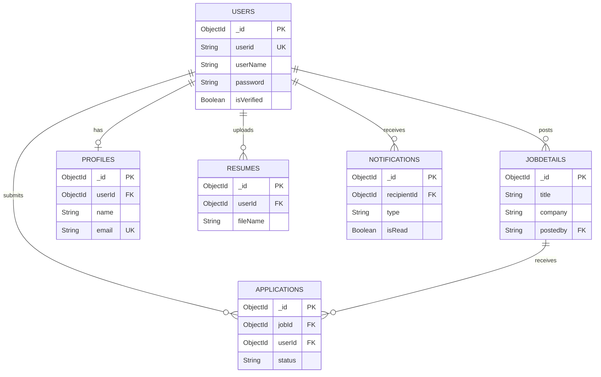

# Database Table Design - Job Portal System

## Table 1: Users Collection

**Collection Name:** `users`  
**Purpose:** Stores verified user accounts (both job seekers and recruiters)

| Field Name | Data Type | Size | Constraints | Description |
|------------|-----------|------|-------------|-------------|
| _id | ObjectId | 12 bytes | Primary Key | Unique identifier for the user |
| userName | String | 255 characters | Required | Full name of the user |
| userid | String | 255 characters | Required, Unique | Email address used for login |
| password | String | 255 characters | Required | Hashed password |
| isVerified | Boolean | 1 byte | Default: false | Email verification status |
| createdAt | Date | 8 bytes | Default: Now | Timestamp of registration |
| updatedAt | Date | 8 bytes | Default: Now | Timestamp of last update |

**Estimated Document Size:** 450-500 bytes per document

---

## Table 2: Pending Users Collection

**Collection Name:** `pendingusers`  
**Purpose:** Temporary storage for unverified user registrations during OTP verification

| Field Name | Data Type | Size | Constraints | Description |
|------------|-----------|------|-------------|-------------|
| _id | ObjectId | 12 bytes | Primary Key | Unique identifier for the pending user |
| userName | String | 255 characters | Required | Full name of the user |
| userid | String | 255 characters | Required | Email address for registration |
| password | String | 255 characters | Required | Hashed password |
| otp | String | 6 characters | Required | One-time password for verification |
| otpExpires | Date | 8 bytes | Required | OTP expiration timestamp |
| createdAt | Date | 8 bytes | Default: Now | Timestamp of registration attempt |
| updatedAt | Date | 8 bytes | Default: Now | Timestamp of last update |

**Estimated Document Size:** 475-550 bytes per document

---

## Table 3: Job Details Collection

**Collection Name:** `jobdetails`  
**Purpose:** Stores all job postings created by recruiters

| Field Name | Data Type | Size | Constraints | Description |
|------------|-----------|------|-------------|-------------|
| _id | ObjectId | 12 bytes | Primary Key | Unique identifier for the job posting |
| title | String | 255 characters | Required | Job title/position |
| company | String | 255 characters | Required | Company name |
| location | String | 255 characters | Required | Job location (city, state, country) |
| type | String | 100 characters | Required | Employment type (Full-time, Part-time, Contract, Internship) |
| salary | String | 100 characters | Optional | Salary range or amount |
| description | String | 5000 characters | Optional | Detailed job description and requirements |
| postedby | String | 255 characters | Required | User ID of the recruiter who posted the job |
| createdAt | Date | 8 bytes | Default: Now | Job posting date |
| updatedAt | Date | 8 bytes | Default: Now | Last modification date |

**Estimated Document Size:** 1-6 KB per document (depending on description length)

---

## Table 4: Applications Collection

**Collection Name:** `applications`  
**Purpose:** Tracks job applications submitted by job seekers

| Field Name | Data Type | Size | Constraints | Description |
|------------|-----------|------|-------------|-------------|
| _id | ObjectId | 12 bytes | Primary Key | Unique identifier for the application |
| jobId | ObjectId | 12 bytes | Required, Foreign Key | Reference to JobDetail document |
| userId | ObjectId | 12 bytes | Required, Foreign Key | Reference to User document |
| applicantName | String | 255 characters | Required | Snapshot of applicant's name |
| applicantEmail | String | 255 characters | Required | Snapshot of applicant's email |
| jobTitle | String | 255 characters | Required | Snapshot of job title |
| company | String | 255 characters | Required | Snapshot of company name |
| status | String (Enum) | 50 characters | Default: 'applied' | Application status: applied, viewed, shortlisted, rejected |
| resumeUrl | String | 500 characters | Optional | URL/path to uploaded resume file |
| appliedAt | Date | 8 bytes | Default: Now | Application submission timestamp |
| createdAt | Date | 8 bytes | Default: Now | Document creation timestamp |
| updatedAt | Date | 8 bytes | Default: Now | Last update timestamp |

**Unique Constraint:** Compound index on (jobId + userId) prevents duplicate applications

**Estimated Document Size:** 600-900 bytes per document

---

## Table 5: Profiles Collection

**Collection Name:** `profiles`  
**Purpose:** Stores detailed user profile information for job seekers

| Field Name | Data Type | Size | Constraints | Description |
|------------|-----------|------|-------------|-------------|
| _id | ObjectId | 12 bytes | Primary Key | Unique identifier for the profile |
| userId | ObjectId | 12 bytes | Required, Unique, Foreign Key | Reference to User document (one-to-one relationship) |
| name | String | 255 characters | Required | Full name of the user |
| dob | String | 50 characters | Optional | Date of birth |
| email | String | 255 characters | Required, Unique | Contact email address |
| location | String | 255 characters | Optional | Current location/address |
| skills | String | 1000 characters | Optional | Comma-separated list of skills |
| **Education - School** |
| schoolname | String | 255 characters | Optional | High school/secondary school name |
| xgpa | String | 50 characters | Optional | 10th grade GPA/percentage |
| xpassout | String | 50 characters | Optional | 10th grade passing year |
| xigpa | String | 50 characters | Optional | 12th grade GPA/percentage |
| xipassout | String | 50 characters | Optional | 12th grade passing year |
| **Education - College** |
| collagename | String | 255 characters | Optional | College/university name |
| degree | String | 100 characters | Optional | Degree obtained (B.Tech, MBA, etc.) |
| department | String | 100 characters | Optional | Department/major/specialization |
| collagegpa | String | 50 characters | Optional | College CGPA/percentage |
| collagepassout | String | 50 characters | Optional | College passing year |
| **Internship Experience** |
| internname | String | 255 characters | Optional | Internship company name |
| startdate | String | 50 characters | Optional | Internship start date |
| enddate | String | 50 characters | Optional | Internship end date |
| internlink | String | 500 characters | Optional | Link to internship certificate/proof |
| **Work Experience** |
| job | String | 255 characters | Optional | Job title/position held |
| companyname | String | 255 characters | Optional | Company name |
| jobexpirience | String | 100 characters | Optional | Years of work experience |
| companycontact | String | 100 characters | Optional | Company contact information |
| projectlink | String | 500 characters | Optional | Link to project portfolio/GitHub |
| **Profile Picture** |
| profilePic.filename | String | 255 characters | Optional | Original filename of uploaded image |
| profilePic.path | String | 500 characters | Optional | File storage path on server |
| profilePic.mimeType | String | 100 characters | Optional | File MIME type (image/jpeg, image/png) |
| profilePic.size | Number | 4-8 bytes | Optional | File size in bytes |
| profilePic.uploadedAt | Date | 8 bytes | Optional | Image upload timestamp |
| **Timestamps** |
| createdAt | Date | 8 bytes | Default: Now | Profile creation timestamp |
| updatedAt | Date | 8 bytes | Default: Now | Last update timestamp |

**Estimated Document Size:** 2-4 KB per document (depending on data completeness)

---

## Table 6: Resumes Collection

**Collection Name:** `resumes`  
**Purpose:** Stores uploaded resume files metadata and extracted text for search functionality

| Field Name | Data Type | Size | Constraints | Description |
|------------|-----------|------|-------------|-------------|
| _id | ObjectId | 12 bytes | Primary Key | Unique identifier for the resume document |
| userId | ObjectId | 12 bytes | Required, Foreign Key | Reference to User document |
| originalName | String | 255 characters | Required | Original filename uploaded by user |
| fileName | String | 255 characters | Required | Stored filename (usually hashed/unique name) |
| filePath | String | 500 characters | Required | File storage path on server/cloud |
| fileType | String | 100 characters | Required | File MIME type (application/pdf, application/msword) |
| fileSize | Number | 4-8 bytes | Required | File size in bytes |
| extractedText | String | 50000 characters | Default: '' | Text extracted from resume for search indexing |
| uploadDate | Date | 8 bytes | Default: Now | Resume upload timestamp |

**Estimated Document Size:** 1-50 KB per document (depending on extracted text length)

---

## Table 7: Notifications Collection

**Collection Name:** `notifications`  
**Purpose:** Stores real-time notifications for users (application updates, new applications, system alerts)

| Field Name | Data Type | Size | Constraints | Description |
|------------|-----------|------|-------------|-------------|
| _id | ObjectId | 12 bytes | Primary Key | Unique identifier for the notification |
| recipientId | ObjectId | 12 bytes | Required, Foreign Key | User ID receiving the notification |
| senderId | ObjectId | 12 bytes | Optional, Foreign Key | User ID who triggered the notification (if applicable) |
| type | String (Enum) | 50 characters | Required | Notification type: NEW_APPLICATION, STATUS_UPDATE, SYSTEM |
| message | String | 500 characters | Required | Notification message text displayed to user |
| data | Object | Variable | Default: {} | Additional metadata (jobId, applicationId, etc.) stored as JSON |
| isRead | Boolean | 1 byte | Default: false | Read/unread status flag |
| createdAt | Date | 8 bytes | Default: Now | Notification creation timestamp |

**Estimated Document Size:** 300-800 bytes per document

---

## Database Relationships

---

## Summary: Storage Estimates

| Collection | Avg Document Size | Expected Documents | Estimated Total Storage |
|------------|-------------------|-------------------|------------------------|
| Users | 475 bytes | 10,000 | ~4.75 MB |
| Pending Users | 512 bytes | 500 (transient) | ~256 KB |
| Job Details | 3 KB | 5,000 | ~15 MB |
| Applications | 750 bytes | 50,000 | ~37.5 MB |
| Profiles | 3 KB | 8,000 | ~24 MB |
| Resumes | 10 KB | 8,000 | ~80 MB |
| Notifications | 550 bytes | 100,000 | ~55 MB |
| **TOTAL** | - | **181,500** | **~216.5 MB** |

---

## Index Strategy

### Primary Indexes
- All collections have automatic `_id` index (Primary Key)

### Secondary Indexes
1. **Users Collection**
   - `userid` (Unique) - For login authentication
   
2. **Job Details Collection**
   - `postedby` - For recruiter's job listings
   - Text index on `title` and `description` - For job search
   
3. **Applications Collection**
   - Compound index: `(jobId, userId)` (Unique) - Prevents duplicate applications
   - `userId` - For user's application history
   - `jobId` - For job's applicant list
   
4. **Profiles Collection**
   - `userId` (Unique) - One-to-one relationship
   - `email` (Unique) - For profile lookup
   
5. **Resumes Collection**
   - `userId` - For user's resume retrieval
   - Text index on `extractedText` - For resume content search
   
6. **Notifications Collection**
   - Compound index: `(recipientId, isRead)` - For unread notifications
   - `createdAt` - For sorting by time

### TTL Index
- **Pending Users Collection**: TTL index on `otpExpires` - Auto-deletes expired records

---

*Document Version: 1.0*  
*Last Updated: January 22, 2026*
