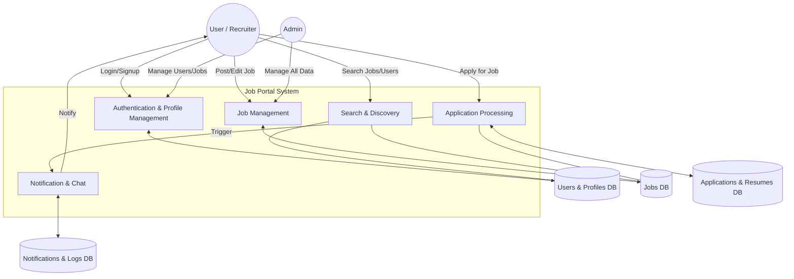
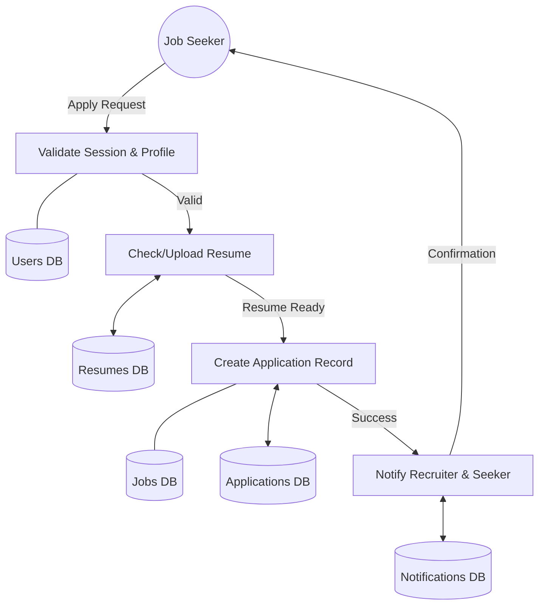
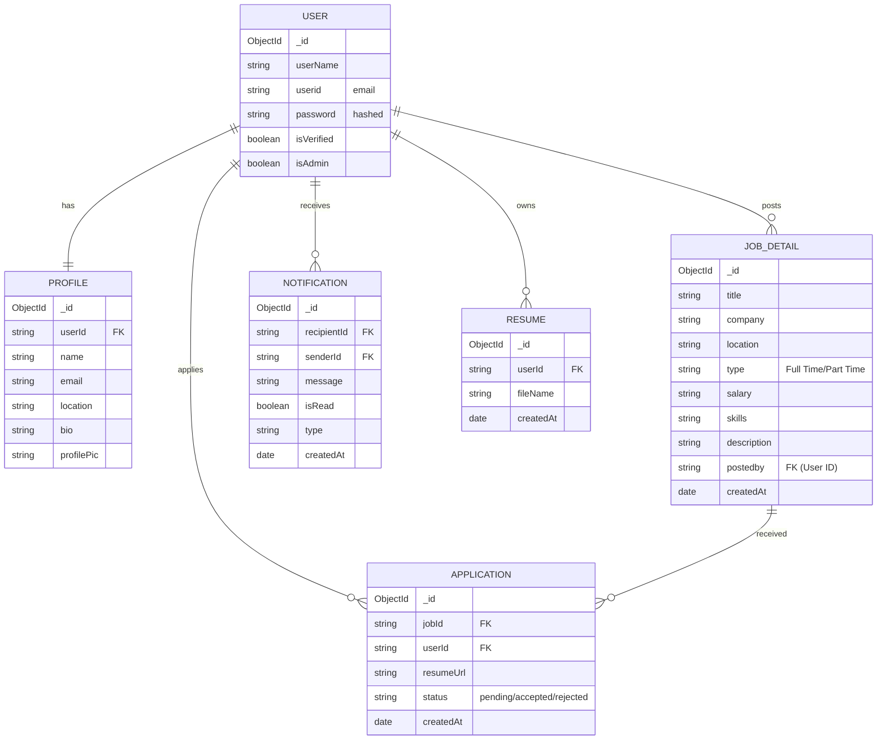

# Job Portal System Diagrams

This document contains the Data Flow Diagrams (DFD) and Entity Relationship (ER) diagram for the Job Portal system.

## 1. DFD Level 1: System Overview

The Level 1 DFD shows the primary processes and data flows between user roles and the system modules.

## 2. DFD Level 2: Job Application Flow

Detailed view of the process when a user applies for a job.

## 3. Entity Relationship (ER) Diagram

Represents the database schema and relationships between entities.

